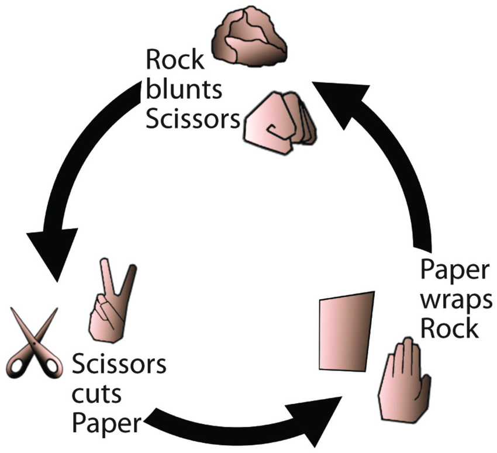

# Rock_Paper_Scissors_By-Mustafa
## This is a simple console"Rock_Paper_Scissors"

A simlpe two player game, where you and your oponent(the computer) choose one the  following three options:
"rock", "paper" ot "scissors". The rule as follows:
- Rock beats scissors
- Scissors beats paper
- Paper beats rock

The winner is the player whose choice beats the choice of his oponent. If both players choose the same option, the game outcome is "draw".
You can choose to continue playing or end the game. After the end of the game, you can see the score, how many times you won, how many times the computer won and how many times it ended in a draw.

· Source code link [Game source code]( https://github.com/sawyer8604/Rock_Paper_Scissors_By-Mustafa/blob/main/Rock_Paper_Scissors/Rock_Paper_Scissors.cs)

# Input and Output 
The player enters one of the following options:
- rick or r
- paper ot p
- scissors or s
The computer choose a random option, then reveals the winner.
For play again or end the game:
- y or Y or yes
- n or N or no

# Screenshots

# Live demo

You can play the game directly in your Web browser

